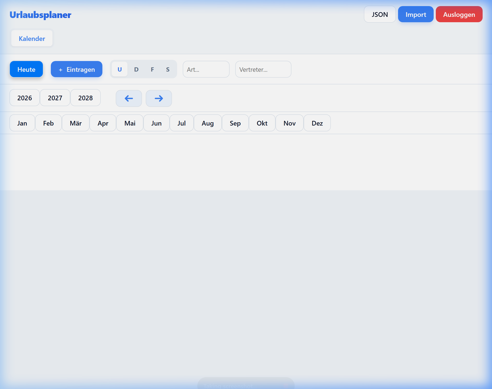
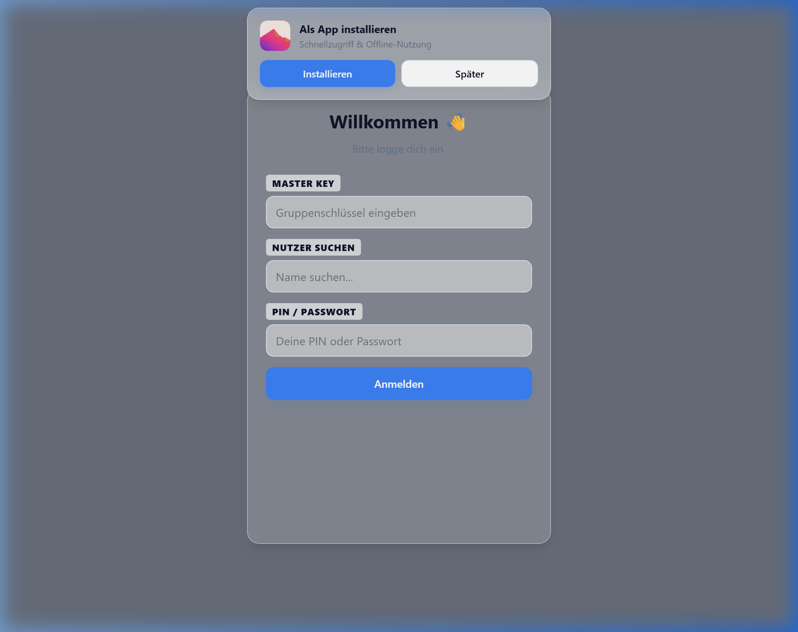

# 🏥 Benutzeranleitung: Urlaubsplaner Assistenzärzte

Herzlich willkommen im neuen Urlaubsplaner. Dieses System ermöglicht eine koordinierte Planung deiner Abwesenheiten direkt innerhalb deiner aktuellen Rotation.

---

## 🔐 1. Anmeldung
1. **URL:** [Urlaubsplaner Assistenzärzte](https://lateina.github.io/urlaubsplaner/assistenz.html)
2. **Login:** Wähle deinen Namen und gib deinen **Master Key** sowie deinen persönlichen **PIN** ein.

---

## ⚡ 2. Abwesenheit beantragen (Der 2-Schritt-Prozess)
Um deinen Urlaub fest im System zu haben, sind zwei Schritte notwendig:

### **Schritt 1: Der Antrag**
- Klicke im Kalender auf einen Tag in **deiner Zeile**.
- Wähle Zeitraum und Art der Abwesenheit.
- **Wichtig:** Wähle einen **Vertreter** aus der Liste. Dir werden nur Kollegen angezeigt, die aktuell in deiner Rotation verfügbar sind.

### **Schritt 2: Die Zustimmung**
- Dein Vertreter erhält nun eine Benachrichtigung im System (roter Punkt am Tab "Anfragen").
- Sobald der Vertreter zustimmt, geht der Antrag zur finalen Prüfung an den Sprecher oder Administrator.

---

## 📅 3. Im Kalender navigieren
Der Kalender bietet nun mehrere intuitive Möglichkeiten zur Navigation:

*   **Mausrad-Scrollen:** Fahre mit der Maus über die **Monats- oder Tages-Kopfzeile**, um direkt horizontal zu scrollen (ohne Shift-Taste).
*   **Greifen & Schieben (Panning):** 
    - Klicke und ziehe in der **Kopfzeile**, um den Kalender zu verschieben.
    - Halte die **mittlere Maustaste** (Mausrad-Klick) oder **Alt + Linksklick** gedrückt, um den Kalender an jeder Stelle zu verschieben.
*   **Pfeil-Navigation:** Nutze die blauen Pfeile (**←** und **→**) neben der Jahresanzeige für schnelle Schritte.
*   **"Heute"-Button:** Mit einem Klick auf **"Heute"** in der Toolbar springst du sofort zum aktuellen Datum.

---

## 🤝 3. Selbst als Vertreter zustimmen
Wenn ein Kollege dich als Vertreter anfragt:
1. Gehe zum Tab **"Anfragen"**.
2. Unter **"Vertretungsanfragen"** siehst du alle Details.
3. Klicke auf **"Zustimmen"** oder gib bei Ablehnung einen kurzen Grund an.

---

## 🔍 4. Status deiner Anträge
Im Tab **"Anfragen"** unter **"Meine Anfragen"** siehst du den aktuellen Verlauf:

| Status | Was passiert gerade? |
| :--- | :--- |
| ⏳ **Wartet auf Vertreter** | Dein Kollege muss noch zustimmen. |
| ⏳ **Wartet auf Admin** | Vertreter hat zugestimmt, Freigabe durch Admin fehlt. |
| ✅ **Genehmigt** | Der Urlaub ist final bestätigt. |
| ❌ **Abgelehnt** | Der Wunsch konnte nicht erfüllt werden. |

---

## 🧩 5. Skills & Rotationen
Über den Tab **"Skills"** erhältst du eine Übersicht, wer aktuell in welchen Bereichen (Station 50-52, ITS, Notaufnahme, etc.) eingeteilt ist. Das hilft dir bei der Auswahl eines geeigneten Vertreters.

---

## 📱 7. PWA-Installation (Smartphone/Desktop)
Installiere den Planer wie eine App für Offline-Zugriff und Schnelligkeit:

*   **Auto-Banner:** Achte auf das Installations-Banner am **oberen Bildschirmrand**, das dich direkt zur Installation einlädt.
*   **Manuell iOS:** Teilen-Icon (Viereck mit Pfeil) ➡️ `Zum Home-Bildschirm`.
*   **Manuell Android:** Drei Punkte oben rechts ➡️ `App installieren`.

---
*Stand: März 2026*
