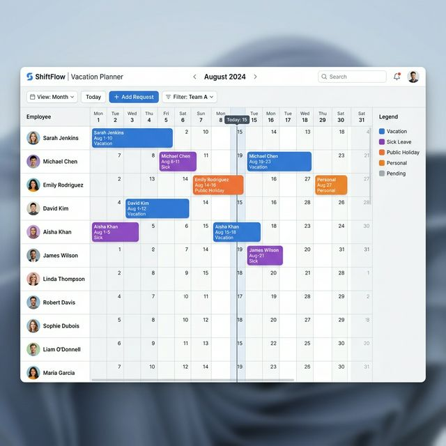
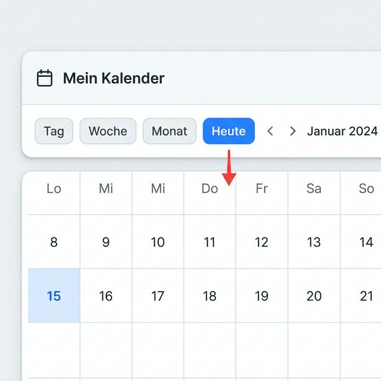
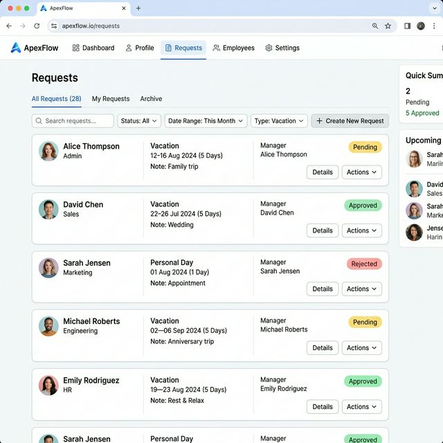
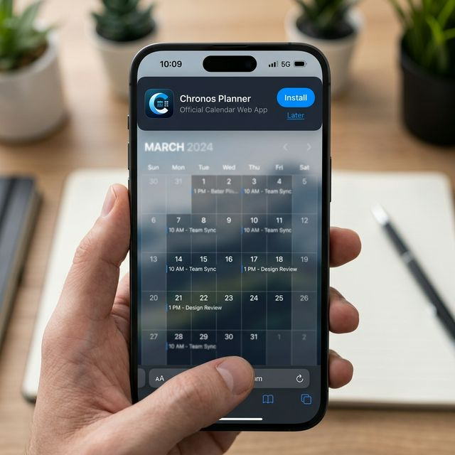

# Benutzeranleitung: Urlaubsplaner Oberärzte

Willkommen beim digitalen Urlaubsplaner. Dieses System hilft uns, Abwesenheiten fair und transparent zu koordinieren, während die Mindestbesetzung in unseren Fachgruppen sichergestellt bleibt.

---

## 1. Der Login
Der Zugang ist einfach und sicher:

1. URL öffnen: [Urlaubsplaner Oberärzte](https://lateina.github.io/urlaubsplaner/index.html)
2. Master Key: Gib den Gruppen-Schlüssel ein (wird im Browser gespeichert).
3. Identifikation: Suche deinen Namen im Dropdown oder über das Suchfeld.
4. PIN: Gib deinen persönlichen 4-stelligen PIN ein.

Tipp: Falls du deinen PIN vergessen hast, kann der Administrator diesen im Bereich "Mitarbeiterverwaltung" einsehen oder zurücksetzen.

---

## 2. Im Kalender navigieren

Zeit-Navigation: Nutze die Jahres-Buttons (2026-2028) und Monats-Buttons am oberen Rand.

Pfeil-Logik: Die blauen Pfeile (<- und ->) neben den Jahren erlauben schnelle Schritte nach links oder rechts.

Mausrad-Komfort: Fährst du mit der Maus über die Kopfzeilen (Monat/Tag), kannst du mit dem Mausrad direkt horizontal scrollen.

Greifen & Schieben: Du kannst den Kalender verschieben, indem du in die Kopfzeile klickst und ziehst, oder an jeder Stelle die mittlere Maustaste oder Alt + Linksklick benutzt.

Heute-Button: Der Button "Heute" in der Toolbar bringt dich sofort zum aktuellen Tag zurück. Ein roter Pfeil markiert kurzzeitig das heutige Datum.

Orientierung: Deine eigene Zeile ist hellblau markiert; Wochenenden grau und bayerische Feiertage rot.

---

## 3. Abwesenheit beantragen
Klicke einfach auf eine Zelle in deiner Zeile, um das Formular zu öffnen:

Anfrage-Details:
- Zeitraum: Start- und Enddatum deiner Abwesenheit.
- Typ: U (Urlaub), D (Dienstreise), F (Fortbildung), S (Sonstiges).
- Beschreibung: Optionaler Text (z.B. Name des Kongresses).
- Vertreter: Pflichtfeld: Wähle einen Kollegen aus deiner Fachgruppe.

---

## 4. Die Mindestbesetzung (Coverage)
Ganz oben im Kalender befindet sich die Zeile "Mindestbesetzung".

Warnung: Erscheint dort ein roter Warntext, wurde für diese Fachgruppe die Mindestbesetzung unterschritten.
Bitte prüfe dies, bevor du einen Antrag stellst, um unnötige Ablehnungen zu vermeiden.

---

## 5. Status & Kontingent

Neben deinem Namen siehst du dein Urlaubskonto (z.B. 12 / 30).
Im Tab "Anfragen" kannst du den Fortschritt deiner Wünsche verfolgen:

Status-Bedeutungen:
- Pending: Antrag wurde eingereicht und wartet auf Bearbeitung.
- Genehmigt: Der Urlaub ist fest eingetragen.
- Abgelehnt: Der Wunsch konnte nicht erfüllt werden (siehe Begründung).

---

## 6. Als App installieren

1. Auto-Installation: Nutze das Banner am oberen Bildschirmrand für eine direkte Installation.
2. iOS (Safari): Teilen -> Zum Home-Bildschirm.
3. Android (Chrome): Drei Punkte -> App installieren.

---
Stand: März 2026
